# Tutorial APAP

## Authors

* **Maritza Rahayu Indriyani** - *2106751474* - *A* 

---
## Tutorial 7
### What I have learned today
Docker, NGINX, & CI/CD

### Pertanyaan
1. Apa itu Dockerfile dan docker-compose.yaml? Apa fungsinya?

`Dockerfile` adalah file yang berisi serangkaian instruksi yang akan digunakan oleh Docker untuk membuat image container.

Fungsi:
- Mendefinisikan basis image untuk mengetahui dari mana suatu image baru akan dibangun.
- Menambahkan dan menginstal paket-paket atau dependensi yang diperlukan oleh aplikasi.
- Menyalin file atau direktori dari sistem lokal ke dalam image.
- Menjalankan perintah yang diperlukan selama pembuatan image.
- Menetapkan environment yang dibutuhkan aplikasi.

`docker-compose.yaml` adalah file yang digunakan untuk mendefinisikan layanan, jaringan, dan volume multi-container.

Fungsi:
- Menyediakan daftar container yang akan dibuat.
- Mendefinisikan jaringan khusus atau jaringan default.
- Menyediakan volume untuk berbagi data antara container satu dengan yang lain.

2. Screenshot hasil perubahan anda. Setelah anda menyelesaikan tutorial ini, menurut anda, mengapa kita perlu mengganti port?

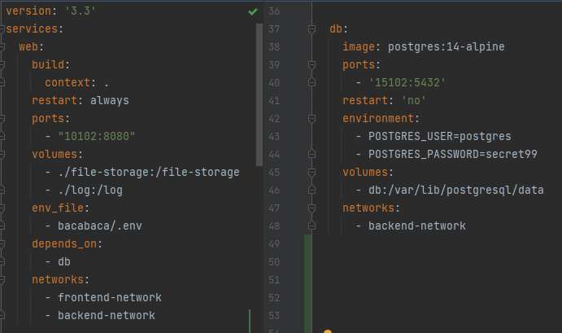

Port tersebut perlu diganti untuk memisahkan lingkungan development dengan lingkungan production 
sehingga meminimalisir terjadinya konflik.

3. Apa saja yang terjadi di langkah ini?

- File .env yang berisi environment variables akan digunakan dalam pengembangan dan produksi aplikasi. 
- Perintah `.\gradlew.bat build -x test` akan menghasilkan file JAR dari proyek Gradle yang sedang dijalankan.
- Perintah `docker-compose up` akan membangun dan menjalankan aplikasi dengan memanfaatkan konfigurasi Docker Compose.
Selanjutnya, Docker Compose akan membangun image yang diperlukan berikut menjalankan container-container yang sesuai. 
Docker Compose juga akan memastikan bahwa layanan database sudah berjalan sebelum layanan web dijalankan, sesuai dengan konfigurasi `depends_on`.

Melalui langkah-langkah ini, aplikasi dapat diakses melalui http://localhost:10102 karena port tersebut telah dimapping ke port 8080 dari layanan web.

4. Sertakan screenshot container yang sedang berjalan (versi gui atau cli, pilih salah satu). Apa itu docker images, docker container, dan docker volume?

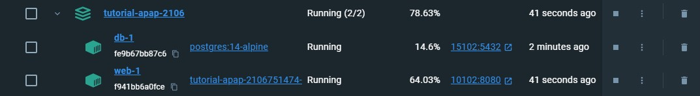

- Docker Images : paket berisi aplikasi beserta semua dependensinya, termasuk sistem operasi, library, dan kode aplikasi.
Image ini adalah blueprint yang digunakan untuk membuat containers dan dapat dianggap sebagai snapshot yang dapat dibagikan dari suatu environment yang dapat berjalan di mana saja.
Images dapat dibuat menggunakan Dockerfile dan dapat disimpan di Docker Hub atau registry Docker lain.
- Docker Container : instance yang berjalan dari Docker Image untuk menyatukan aplikasi beserta seluruh dependensinya.
Container membuat deployment menjadi lebih mudah karena memastikan bahwa aplikasi beserta dependensinya berjalan dengan cara yang konsisten di berbagai environment.
- Docker Volume : menyimpan data yang dibutuhkan oleh container meskipun container tersebut dihancurkan atau diperbarui.

5. Apa perbedaan docker-compose down dan docker stop?

`docker-compose down` digunakan untuk menghentikan dan menghapus layanan yang didefinisikan di dalam file `docker-compose.yml`.
Perintah ini akan mematikan dan menghapus seluruh environment yang dibuat saat `docker-compose up` termasuk container, volume, dan network.
Sedangkan `docker stop` digunakan untuk menghentikan container yang sedang berjalan tanpa menghapus sumber daya tambahan seperti volume atau network.
Container yang dihentikan masih ada di dalam sistem dan dapat dijalankan kembali dengan perintah `docker start`.

6. Sertakan screenshot mengakses laman kirti milik anda melalui browser (seperti screenshot di atas)

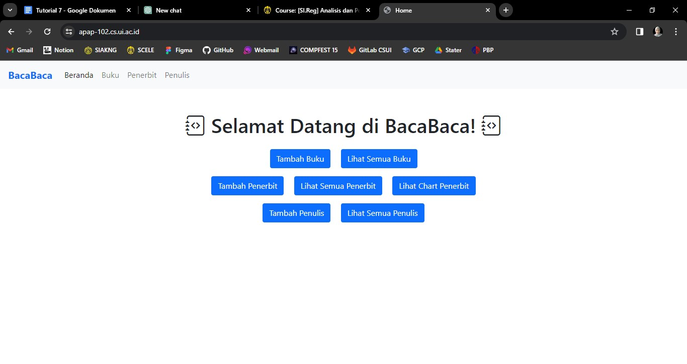

7. Ceritakan pengalaman anda melakukan deployment ke Kirti. Kendala apa yang anda alami?

Aku baru tau ada server yang namanya Kirti. Selama ngerjain tutorial ini, jadi selalu keinget tugas SOSI yang pake bash kayak gini juga (ribet dan nyebelin).
Kendala yang aku alami mulai dari proses mem-build jar menggunakan perintah `bash gradlew build -x test` memakan waktu yang tidak sebentar, terus waktu jalanin perintah
`docker-compose up -d` dan `docker-compose down` juga gak bisa sekali coba langsung jalan, minimal 2x lah. Errornya selalu karena connection. Huft :(

8. hah


9. Buka container docker Anda, lalu screenshot. Apa perbedaan tampilan container sekarang dengan tampilan container pada langkah tutorial docker di awal tadi?

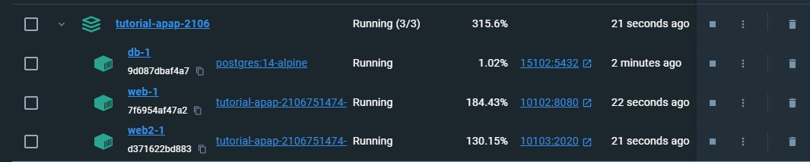

Terdapat tambahan container web2-1. Hal tersebut terjadi karena terdapat penambahan kode pada file `docker-compose.yml` yang berisi sebagai berikut.

```
web2:
    build:
      context: .
    restart: always
    ports:
      - "10103:2020"
    volumes:
      - ./file-storage:/file-storage
      - ./log:/log
    env_file:
      - bacabaca/.env.app2
    depends_on:
      - db
    networks:
      - frontend-network
      - backend-network
```

10. Sertakan screenshot tampilan web ketika pertama kali menjalankan localhost:9090/port dan tampilan web ketika halaman di-refresh.

Gak bisa :( Selalu muncul gini dari awal sampai refresh berkali-kali juga

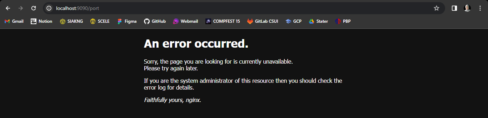

11. Apa yang dimaksud load balancing?  Pada langkah keberapa kita mengatur konfigurasi untuk load balancing? Jelaskan blok baris yang mengatur hal tersebut.

Load balancing adalah suatu metode yang digunakan untuk mendistribusikan lalu lintas jaringan atau beban kerja komputasi secara merata ke sejumlah server atau sumber daya komputasi lainnya.
Tujuan dari load balancing ini adalah untuk memastikan agar tidak ada satu server atau sumber daya tertentu yang mengalami beban kerja berlebihan, sementara
yang lainnya memiliki beban kerja ringan.

Kita mengatur konfigurasi load balancing pada langkah ke-9 di dalam file `nginx.conf` pada block `http` seperti berikut.
```
http {
    # ...

    upstream homepage {
        server localhost:10102;
        server localhost:10103;
    }

    server {
        listen       9090;

        location / {
            proxy_pass "http://homepage";
        }

        # ...
    }

    # ...
}
```

`upstream homepage` digunakan untuk mendefinisikan kelompok server yang akan dilakukan load balancing, yaitu `server localhost:10102;` dan `server localhost:10103;`

`location /` digunakan untuk mengatur konfigurasi untuk request yang masuk ke dalam root URL ("/") di mana `proxy_pass "http://homepage";` akan mengarahkan permintaan ke server yang telah didefinisikan dalam kelompok `homepage`, sehingga
Nginx akan melakukan load balancing di antara server-server ini.

`listen 9090` merupakan server yang dapat diakses dari luar dan akan menerima permintaan dari pengguna.

12. Apa yang dimaksud reverse proxy?  Pada langkah keberapa kita mengatur konfigurasi untuk reverse proxy?

Reverse proxy adalah server yang berfungsi sebagai perantara antara klien dengan server di belakangnya.
Ketika klien mengirimkan permintaan ke server, reverse proxy lah yang akan menerima permintaan tersebut baru kemudian mengirimkannya ke server yang sesungguhnya.

Konfigurasi untuk reverse proxy diatur bersamaan dengan load balancing pada langkah ke-9.

13. Jelaskan baris yang mengatur hal tersebut dan jelaskan kegunaannya dalam pengerjaan tugas kelompok nanti.
```
server {
    listen       9090;

    location / {
        proxy_pass "http://homepage";
    }

    # ...
}
```

Melalui konfigurasi ini, Nginx akan menerima permintaan dari klien pada port 9090 dan meneruskannya ke server atau kelompok server di belakangnya.
Dalam pengerjaan tugas kelompok, konfigurasi Nginx ini akan sangat berperan dalam mengurangi beban dalam satu server (load balancing) yang diakses secara bersamaan oleh banyak orang. 

14. Kendala apa yang anda hadapi ketika melakukan tutorial bagian nginx?

Kendala yang saya hadapi adalah page `active-port.html` tidak berhasil dirender padahal konfigurasi sudah sesuai.
Page yang muncul adalah connection refused atau seperti berikut.

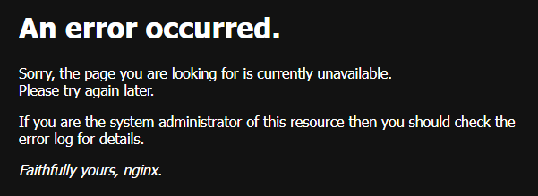

Saya sudah coba uninstall kemudian reinstall nginx nya lagi, sudah mencoba nginx dari berbagai versi, namun tetap tidak berhasil.

15. Apa fungsi dari SSH keys yang Anda buat dengan menggunakan ssh-keygen? Apa perbedaan antara file ~/.ssh/deployer_apap.pub dan ~/.ssh/deployer_apap ?

SSH keys yang dibuat dengan menggunakan `ssh-keygen` memiliki fungsi sebagai metode autentikasi yang lebih aman daripada penggunaan password.

`~/.ssh/deployer_apap` merupakan private key yang digunakan untuk membuktikan identitas pengguna saat terhubung ke server. Private key ini harus tetap aman dan hanya ada di sistem pengguna.

`~/.ssh/deployer_apap.pub` merupakan public key yang dapat dibagikan ke server atau sistem lain yang akan memverifikasi identitas pengguna.

16. Apa perbedaan antara GitLab repository dan GitLab runner?

`GitLab Repository` adalah tempat penyimpanan proyek Git, sedangkan `GitLab Runner` adalah alat untuk menjalankan otomatisasi CI/CD pada proyek tersebut. Runner memungkinkan GitLab untuk secara otomatis menjalankan langkah-langkah CI/CD pada kode yang diunggah ke repositori.

17. Apa perbedaan antara Continuous Integration, Continuous Delivery, dan Continuous Deployment?

- `Continuous Integration (CI)` fokus pada penggabungan dan integrasi kode secara teratur.
- `Continuous Delivery (CD)` memastikan bahwa perangkat lunak dapat diimplementasikan dengan cepat.
- `Continuous Deployment` melibatkan rilis otomatis ke produksi setelah berhasil melewati semua tahap uji dan persetujuan.

18. Apa perbedaan dari stages-stages yang berada dalam file .gitlab-ci.yml?

- `build` berfokus pada kompilasi kode
- `test` berfokus pada pengujian
- `build-image` dan `publish-image` berfokus pada pembuatan dan distribusi Docker image
- `deploy` berfokus pada penerapan aplikasi ke server tujuan

19. Pada script gitlab-ci.yml, terdapat perubahan if: $CI_COMMIT_BRANCH == 'main' menjadi if: $CI_COMMIT_BRANCH == 'feat/tutorial-7-bacabaca'. Apa fungsi dari perubahan tersebut?

Perubahan tersebut berfungsi untuk menjalankan script hanya jika suatu commit atau perubahan di-push ke branch `feat/tutorial-7-bacabaca`.

20. Apa yang dimaksud dengan "docker registry"? Apa fungsinya?

`Docker Registry` adalah tempat di mana kita dapat menyimpan, mengelola, dan mendistribusikan image Docker.
Contoh Docker Registry yang umum digunakan adalah Docker Hub. 

Fungsi Docker Registry :
- Menyimpan image yang telah dibuat secara lokal atau dihasilkan melalui proses CI/CD.
- Memberikan tag pada image untuk menandakan versi tertentu, membantu dalam pelacakan dan pengelolaan perubahan.
- Distribusi image ke berbagai lingkungan dan memfasilitasi kolaborasi tim.
- Memastikan keamanan selama distribusi image sehingga membantu melindungi integritas dan keaslian image Docker.

21. Dalam gitlab CI/CD, apa perbedaan antara: pipeline, stage, dan job?

`Pipeline` adalah serangkaian job yang dieksekusi secara berurutan. Pipeline berfungsi untuk merepresentasikan seluruh alur CI/CD, dimulai dari sumber kode
hingga pengujian dan implementasi. Setiap perubahan dalam repositori akan memicu pembuatan pipeline.

`Stage` adalah bagian dari pipeline yang berisi satu atau lebih job yang seharusnya dijalankan bersama-sama. Stage memecah pipeline menjadi tahap-tahap tertentu.
Stage memungkinkan kita untuk mengelompokkan job ke dalam beberapa fase, seperti "build," "test," dan "deploy," sehingga memudahkan untuk melihat dan memahami progres dan hasil CI/CD.

`Job` adalah unit eksekusi yang melakukan tugas tertentu dalam pipeline. Contoh job adalah melakukan kompilasi kode, pengujian, atau distribusi aplikasi.

Hubungan ketiganya:
- Satu pipeline dapat memiliki beberapa stage, dan setiap stage dapat memiliki satu atau lebih job.
- Setiap stage dalam pipeline dijalankan setelah berhasil menyelesaikan stage sebelumnya.
- Setiap job dalam satu stage dijalankan secara bersamaan, kecuali jika ada ketergantungan antar job.

22. Sertakan screenshot fullscreen saat Anda mengakses apap-102.cs.ui.ac.id ketika sudah berhasil men-deploy aplikasi menggunakan CI/CD!

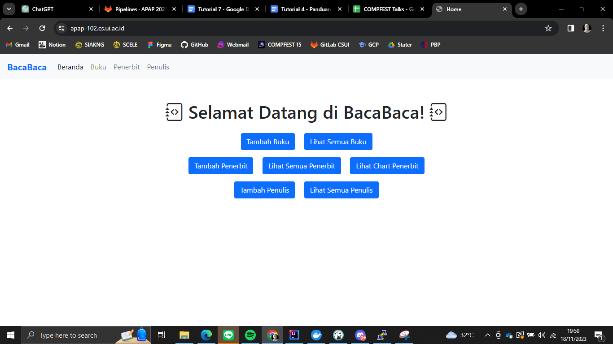

23. Kapan proses CI/CD dijalankan di GitLab?

Proses CI/CD dijalankan di GitLab ketika ada perubahan pada repositori yang memicu event tertentu, seperti push ke branch atau pembukaan merge request.

24. Mengapa CI/CD ini penting? Apa manfaatnya?

CI/CD penting karena memungkinkan otomatisasi proses pengujian, pengintegrasian, dan penyebaran perangkat lunak.
CI/CD bermanfaat dalam meningkatkan kualitas kode, mempercepat siklus pengembangan, dan meminimalkan risiko kesalahan dalam pengiriman perangkat lunak ke produksi.

### What I did not understand
- [ ] Banyak

---
## Tutorial 6
### What I have learned today
Advanced Git, JMeter, dan JConsole

### Pertanyaan
1. Apa yang menjadi penyebab dari CONFLICT tersebut?

Conflict tersebut terjadi karena bagian body pada file index.html mengandung 2 isi yang berbeda.
Pada branch `feat/tutorial-6-advancedgit-1`, isi bagian body pada `index.html` adalah "Body from feat/tutorial-6-advancedgit-1".
Sedangkan, pada branch `tut6-for-merge`, isi bagian body pada `index.html` adalah "Body from tut6-for-merge".

2. Jelaskan perbedaan dari "rebase –continue", "rebase –skip", dan "rebase –abort"!

- `rebase –continue` : digunakan ketika kita sedang dalam proses rebase dan telah menyelesaikan konflik pada suatu commit. Command ini memungkinkan kita untuk melanjutkan proses rebase ke commit berikutnya.
- `rebase –skip` : digunakan ketika kita ingin melewati commit yang tidak relevan atau tidak diperlukan ketika sedang dalam proses rebase.
- `rebase –abort` : digunakan untuk mengembalikan branch ke keadaan sebelum kita memulai rebase, sehingga semua perubahan akan dibatalkan.

3. Apa perbedaan Git Merge dengan Git Rebase? Buatlah/carilah ilustrasi yang dapat menggambarkan perbedaanya!

`Git Merge` :
- Melibatkan penggabungan dua branch secara langsung.
- Membuat sebuah commit baru yang mencakup perubahan dari branch yang ingin digabungkan ke branch tujuan.
- Memelihara history commit asli dari kedua branch, menciptakan grafik commit yang lebih jelas dan transparan.

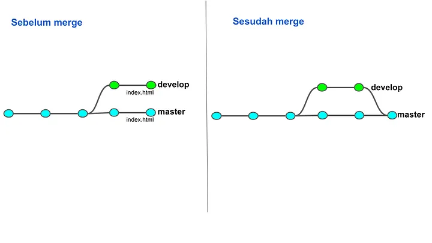

`Git Rebase` :
- Menggabungkan perubahan dari satu branch ke branch lain dengan cara "memindahkan" atau "menempatkan ulang" commit pada branch target.
- Menghasilkan sejarah commit yang lebih linear, karena commit dari branch sumber dipindahkan ke branch target, sehingga terlihat seolah-olah commit tersebut terjadi langsung setelah commit terbaru pada branch target.
- Biasanya menciptakan history commit yang lebih bersih, tetapi mengubah sejarah commit yang sudah ada, yang bisa mempengaruhi kolaborasi pada branch bersama.

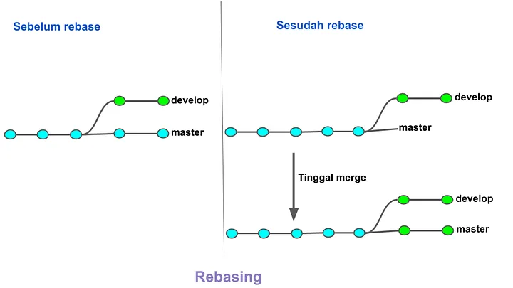

4. Mengapa hal pada langkah no 4 bisa terjadi? Mengapa git stash menjadi solusinya?

Hal tersebut bisa terjadi karena saat mencoba berpindah ke branch `feat/tutorial-6-advancedgit-1`, terdapat perubahan yang belum di-commit pada file `feature-stash.txt` di branch `feature-stash-1`. 
Git menghalangi pergantian branch karena branch `feat/tutorial-6-advancedgit-1` memiliki perubahan yang bertentangan dengan perubahan yang ada di branch `feature-stash-1`. 
Git melindungi kita agar perubahan yang dilakukan tidak hilang atau tertimpa.

`git stash` digunakan untuk menyimpan sementara perubahan yang belum di-commit di dalam stash (seperti tempat penyimpanan sementara) sehingga memungkinkan kita untuk membersihkan working directory dan beralih ke branch lain tanpa konflik atau masalah terkait perubahan yang belum disimpan.


5. Sebutkan dan jelaskan tiga tipe dari Git Reset!

- `Soft Reset` : Soft reset memungkinkan kita untuk mengubah posisi HEAD (penanda teratas pada cabang) tetapi mempertahankan perubahan yang ada di area staging.
  Saat melakukan soft reset, commit yang diarahkan oleh HEAD berubah, tetapi perubahan dalam working directory dan staging area tidak terpengaruh.
  Cara kerjanya memungkinkan kita untuk membatalkan commit terakhir sambil tetap menyimpan perubahan yang sudah ada.
- `Mixed Reset` : Ketika kita tidak memberikan tipe reset secara spesifik, by default akan dilakukan mixed reset.
  Reset jenis ini akan mengubah posisi HEAD dan mereset perubahan di area staging (index), namun tidak mengubah perubahan dalam working directory.
  Perubahan yang ada di commit yang di-reset kembali akan berpindah ke working directory sehingga kita dapat meninjau ulang perubahan tersebut sebelum melakukan commit ulang.
- `Hard Reset` : Hard reset mengubah posisi HEAD, menghapus perubahan di staging area, dan mengembalikan working directory ke kondisi dari commit yang ditunjuk oleh reset.
  Ini merupakan reset paling kuat yang mengembalikan keadaan repositori ke commit tertentu serta menghilangkan perubahan yang ada, sehingga perlu dilakukan dengan hati-hati karena dapat menyebabkan hilangnya perubahan yang belum disimpan.

6. Apa itu git revert? Apa perbedaannya dengan git reset?

`Git Revert` :
- Perintah git revert digunakan untuk membatalkan sebuah commit tertentu dengan membuat commit baru yang membalik perubahan yang terjadi pada commit tersebut.
- Git revert menghasilkan commit balik yang merepresentasikan penghapusan perubahan pada commit sebelumnya tanpa menghilangkan sejarah commit sebelumnya.
- Menggunakan git revert, commit awal tetap ada, dan kita dapat melihat riwayat perubahan yang telah dibuat.

Perbedaan utamanya :
- `Git revert` membatalkan commit dengan membuat commit baru yang membalik perubahan, sementara `git reset` mengatur ulang keadaan repositori ke commit tertentu dan menghapus sejarah commit setelahnya.
- `Git revert` mempertahankan sejarah commit dan menunjukkan perubahan yang dilakukan, sedangkan `git reset` menghapus sejarah commit setelahnya.

7. Buatlah grafik yang menggambarkan alur commit pada bagian Git Flow and Branching ini serta jelaskan! Grafik dapat berupa tulis tangan maupun menggunakan software.

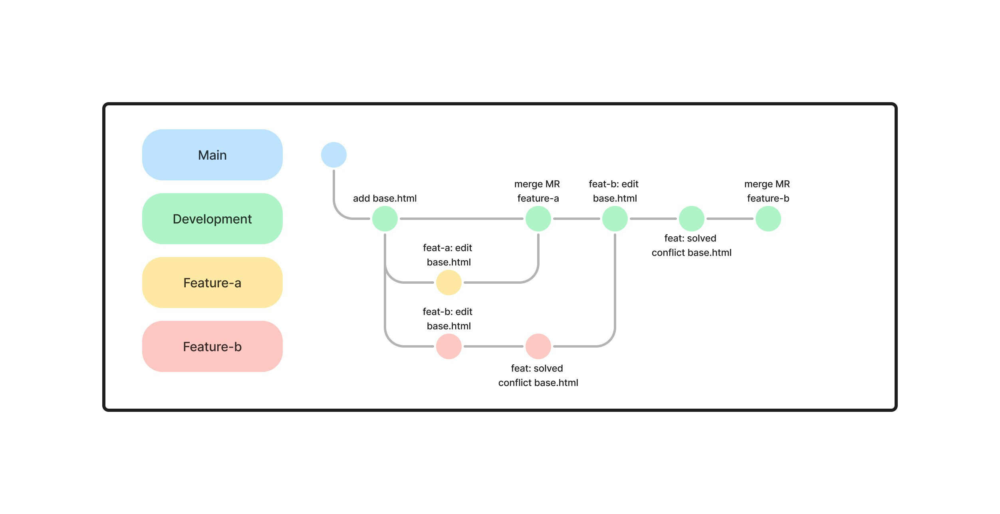

- Alur ini dimulai dari branch `main`
- Pada branch `development` tambahkan file `base.html`.
- Dari branch `development`, buat 2 branch baru yaitu `Feature-a` dan `Feature-b`. 
- Sesuaikan kode pada file `base.html` pada branch `Feature-a` dan `Feature-b` seperti yang tertera pada dokumen soal.
- Buat merge request dari branch `Feature-a` ke branch `Development`, kemudian merge.
- Buat merge request dari branch `Feature-b` ke branch `Development`, kemudian merge. Namun, terdapat conflict sehingga kita solved conflict pada file `base.html` terlebih dahulu.
- Setelah tidak ada conflict, maka merge dari branch `Feature-b` ke branch `Development` bisa dilakukan.

8. Apa kegunaan dari langkah di atas?

Langkah tersebut berguna untuk memastikan bahwa setiap permintaan yang dibuat oleh Thread Group atau request yang akan dieksekusi dalam pengujian beban memiliki header `content-type` dengan nilai `application/json` yang diperlukan ketika kita melakukan komunikasi dengan server yang mengharapkan data dalam format JSON.

9. Apa itu JSON Extractor? Sebutkan semua kegunaannya di Test Plan ini!

JSON Extractor pada JMeter adalah sebuah komponen yang memungkinkan ekstraksi data dari respons HTTP yang diterima dalam format JSON, kemudian menyimpan nilai-nilai ini ke dalam variabel JMeter untuk digunakan dalam langkah-langkah selanjutnya di dalam Test Plan.

Kegunaan JSON Extractor dalam Test Plan ini adalah sebagai berikut.
- Ekstraksi Data dari Respons JSON : 
JSON Extractor digunakan untuk mengekstraksi nilai tertentu dari JSON response yang dihasilkan dari permintaan HTTP.
Nilai-nilai yang diekstraksi disimpan dalam variabel JMeter, yaitu `idBuku`.
- Penggunaan Kembali Nilai yang Diekstraksi : Nilai yang disimpan dalam variabel JMeter (`idBuku`) dapat digunakan kembali dalam langkah-langkah selanjutnya dari pengujian untuk keperluan pengujian lanjutan atau verifikasi.
- Verifikasi Data dalam Respons : JSON Path expression `$.id`, JMeter akan mencari nilai `id` dalam JSON response dan menyimpannya dalam variabel `idBuku`.
- Dynamic Handling dan Data-Driven Testing : JSON Extractor memungkinkan pengambilan dinamis dari respons, yang sangat berguna untuk menghadapi perubahan data yang dihasilkan oleh server dari waktu ke waktu. Nilai-nilai yang diekstraksi ini memungkinkan kita untuk membangun pengujian berikutnya berdasarkan respons aktual yang diterima dari server.

10. Apa itu Assertions dalam JMeter? Sebutkan contoh 3 Assertions dan kegunaannya!

Dalam JMeter, Assertions digunakan untuk memverifikasi respons dari server atau aplikasi web dan memastikan bahwa respons tersebut sesuai dengan harapan. Assertions membantu dalam memvalidasi data yang diterima dari server selama pengujian beban (load testing) atau pengujian kinerja.

- `Response Assertion` : digunakann untuk memverifikasi apakah respons dari server sesuai dengan kriteria yang ditetapkan.
- `Duration Assertion` : digunakan untuk memeriksa durasi respons server dan memvalidasi apakah waktu respons masuk dalam rentang waktu yang diharapkan.
- `Size Assertion` : digunakan untuk memverifikasi ukuran respons yang diterima dari server.

11. Apa itu Number of Threads dan Ramp-up Period? Apa hubungan antar keduanya?

`Number of Threads` (Jumlah Thread) merupakan jumlah pengguna virtual (thread) yang akan digunakan untuk menjalankan skenario pengujian secara bersamaan di mana setiap thread mewakili sebuah pengguna atau koneksi ke server yang akan mengirimkan permintaan.
Contohnya, jika kita mengatur 1000 "Number of Threads", ini berarti 1000 pengguna virtual akan dibuat untuk menjalankan skenario pengujian.

`Ramp-up Period` (Waktu Peningkatan) merupakan periode waktu yang dibutuhkan JMeter untuk memulai seluruh jumlah thread atau pengguna secara bertahap (ramp-up) dalam skenario pengujian yang dihitung dalam detik.
Contohnya, jika kita mengatur "Ramp-up Period" selama 100 detik, dan "Number of Threads" 1000, maka JMeter akan memulai satu thread setiap 0.1 detik (total 1000 thread dalam 100 detik).

Hubungan antar keduanya :
`Ramp-up Period` digunakan untuk mengendalikan kecepatan di mana pengguna virtual atau thread ditambahkan ke dalam pengujian.
Jika `Ramp-up Period` diatur lebih tinggi daripada `Number of Threads`, JMeter akan menambahkan thread secara bertahap sesuai dengan waktu yang ditentukan dalam `Ramp-up Period`.
Keduanya bekerja bersama untuk menentukan bagaimana beban kerja akan ditetapkan ke server. Jumlah thread yang ditambahkan setiap detik (dalam `Ramp-up Period`) akan mempengaruhi tingkat beban yang akan diterima oleh server.

12. Gunakan angka 1000 untuk Number of Threads dan 100 untuk Ramp-up period. 
Jalankan Test Plan dengan konfigurasi tersebut. Kemudian, perhatikan Summary Report, View Result Tree, Graph Result, dan Assertion Result. 
Buatlah penjelasan minimal 2 paragraf untuk menjelaskan temuan menarik kalian terhadap hasil-hasil tersebut. 
Sertakan screenshot dari keempat result tersebut. Sertakan juga info mengenai prosesor, RAM, dan penggunaan hardisk HDD atau SSD dari perangkat Anda. (Jika perangkat Anda tidak kuat dengan angka konfigurasi tersebut, silakan turunkan angkanya.)

Dengan konfigurasi tersebut, kita akan mensimulasikan beban kerja yang setara dengan 1000 pengguna secara bersamaan dalam rentang waktu 100 detik. 
Setiap 0.1 detik, satu thread baru akan dimulai, sehingga dalam 100 detik sebanyak 1000 thread akan aktif menjalankan skenario pengujian yang ditetapkan.

Berikut adalah screenshot dari `Summary Report` yang dihasilkan.
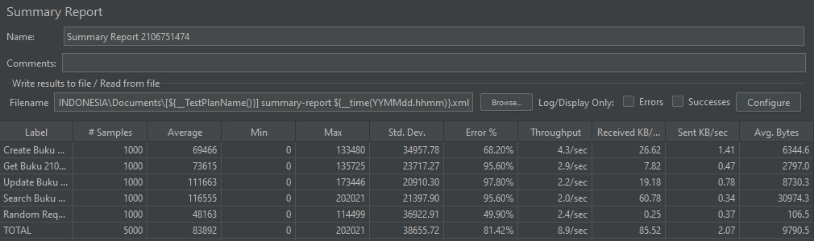
Dapat dilihat bahwa method get, update, dan search memiliki persentase error > 90%. Hal ini menunjukkan bahwa mayoritas dari sampel yang dieksekusi menghasilkan kesalahan. Berdasarkan beberapa sumber yang saya baca, hal ini dapat disebabkan oleh hal-hal berikut.
- Beberapa kesalahan server : mungkin server tidak mampu menangani jumlah permintaan yang diterima.
- Kesalahan pada aplikasi : mungkin ada bug atau kesalahan yang menyebabkan respons tidak benar atau permintaan gagal diproses.
- Overload sistem atau server : kapasitas server mungkin sudah melebihi batasnya.

Berikut adalah screenshot dari `View Results Tree` yang dihasilkan.
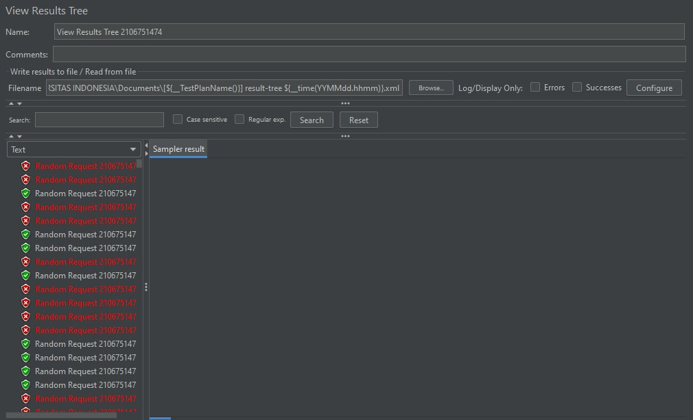
Dapat dilihat bahwa dalam satu method yang sama, sebagian berhasil dan sebagiannya lagi gagal dieksekusi. Untuk mengidentifikasi jenis kesalahan yang terjadi, kita bisa
memeriksa informasi lebih lanjut dari log atau output yang dihasilkan oleh JMeter.

Berikut adalah screenshot dari `Graph Results` yang dihasilkan.
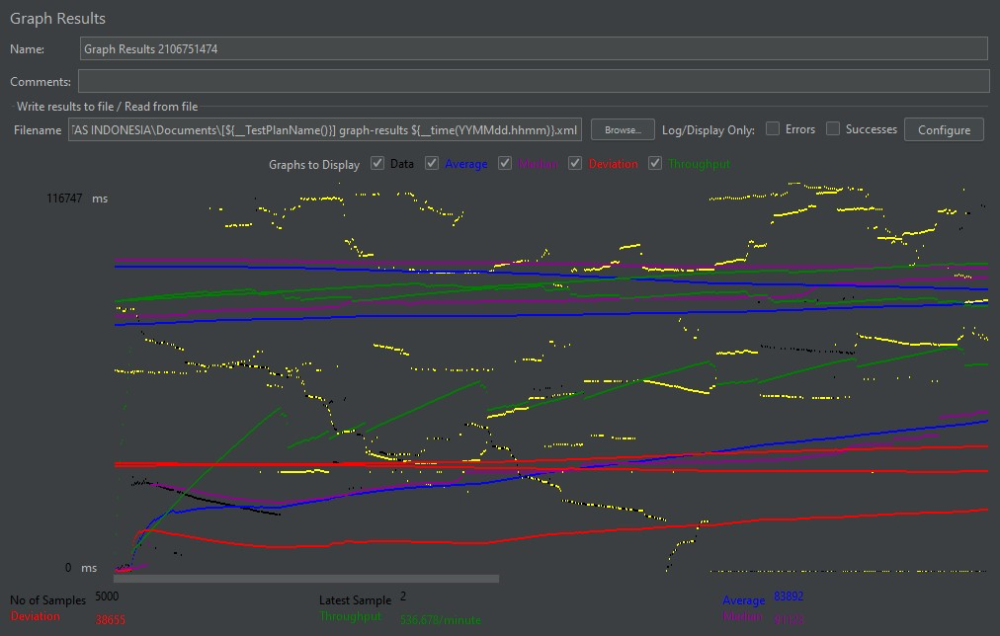
Grafik di atas berbentuk line chart yang menampilkan metrik kinerja seperti waktu respons, throughput, atau kesalahan dalam bentuk visual sehingga lebih mudah dipahami.

Berikut adalah screenshot dari `Assertion Results` yang dihasilkan.
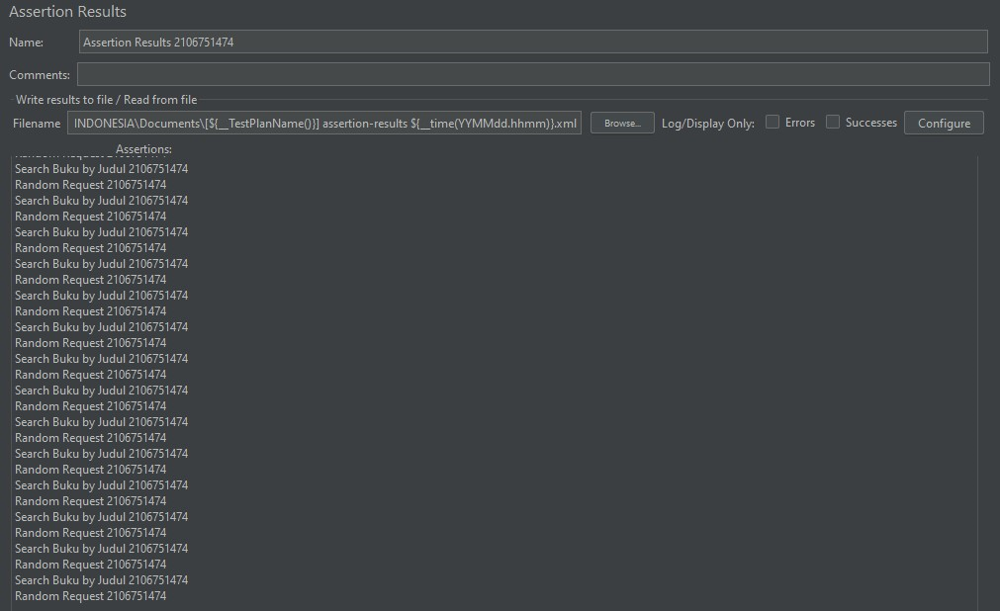
Dari gambar di atas, kita dapat melihat hasil assertion pada setiap permintaan dan mengevaluasi apakah kondisi atau kriteria yang didefinisikan telah terpenuhi atau tidak.
Informasi yang diberikan dalam Assertion Results dapat digunakan untuk melakukan debug, verifikasi, dan validasi terhadap respons server yang diterima.

Informasi mengenai perangkat 
- Prosesor : intel core i7
- RAM : 8 GB
- HDD/SSD : SSD

13. Sembari menjalankan Test Plan, perhatikan pergerakan grafik pada JConsole. Buatlah penjelasan minimal 2 paragraf untuk menjelaskan temuan menarik kalian terhadap hasil-hasil tersebut. Sertakan screenshot dari grafik-grafik tersebut.

Berikut adalah screenshot grafiknya.
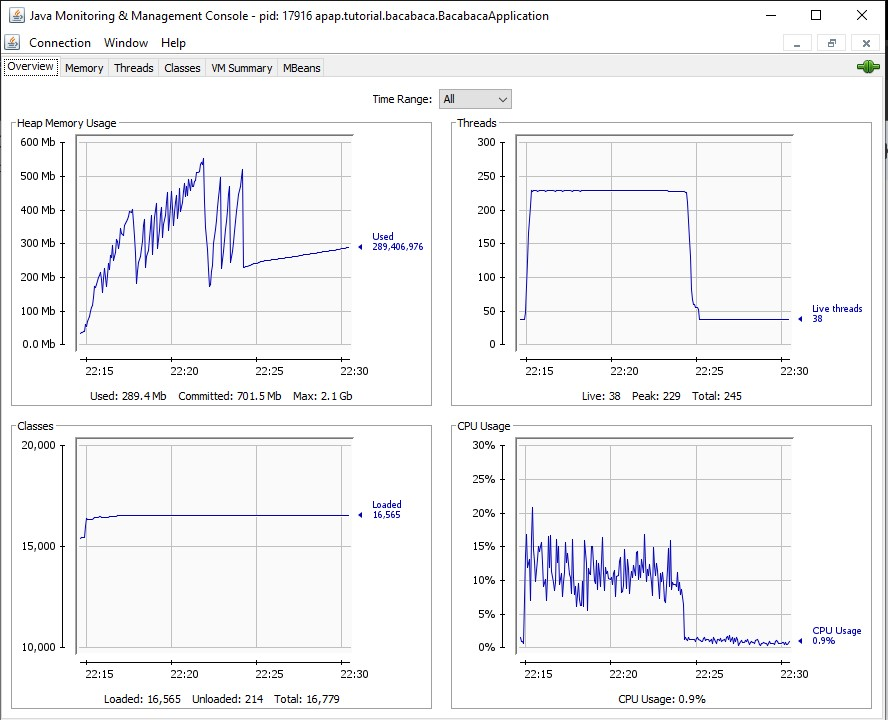

- `Heap Memory Usage` : menampilkan penggunaan memori heap dari aplikasi. Ini memberikan informasi tentang penggunaan memori dalam heap, termasuk total memori, memori yang digunakan, dan memori yang tersedia.
Nilai "289,406,976" merepresentasikan jumlah memori yang telah dialokasikan dalam heap oleh aplikasi pada saat pengukuran dilakukan.
  Hal ini dapat diartikan bahwa aplikasi menggunakan sekitar 289,406,976 byte (atau sekitar 289 MB) dari memori heap pada saat pemantauan dilakukan.
- `Threads` : menampilkan jumlah thread yang sedang berjalan dalam aplikasi. Terdapat tulisan "Live threads 38" yang berarti pada saat pemantauan dilakukan, terdapat 38 thread yang sedang aktif atau berjalan dalam aplikasi yang sedang dimonitor.
- `Classes` : menampilkan jumlah kelas yang dimuat oleh aplikasi. 
Tulisan "Classes loaded 16,565" menunjukkan bahwa pada saat pemantauan dilakukan, aplikasi telah memuat sebanyak 16,565 kelas.
- `CPU Usage` : menunjukkan penggunaan CPU oleh aplikasi. Informasi "CPU usage 0.9%" menunjukkan bahwa pada waktu tertentu, aplikasi Java hanya menggunakan sekitar 0.9% dari total daya pemrosesan CPU yang tersedia.
  Semakin rendah persentase penggunaan CPU, semakin sedikit daya pemrosesan yang digunakan aplikasi, yang umumnya dianggap sebagai indikator kinerja yang baik.

Informasi yang diperoleh dari grafik-grafik ini memberikan pemahaman yang signifikan mengenai penggunaan sumber daya aplikasi. 
Memantau penggunaan memori, thread aktif, jumlah kelas, dan penggunaan CPU membantu pengembang dan administrator sistem dalam mengelola kinerja aplikasi. 
Data-data ini penting untuk mengetahui seberapa efisien aplikasi dalam mengelola sumber daya yang tersedia serta dapat membantu dalam mendeteksi potensi masalah atau optimasi yang diperlukan untuk meningkatkan performa aplikasi secara keseluruhan.

14. Apa itu Load Testing? Buatlah kesimpulan dari pengerjaan tutorial JMeter & JConsole ini.

Load Testing adalah metode pengujian perangkat lunak yang bertujuan untuk mengevaluasi kinerja sistem atau aplikasi di bawah beban atau beban tertentu. 
Tujuannya adalah untuk memahami bagaimana sistem atau aplikasi akan bertindak dan menanggapi dalam situasi penggunaan yang tinggi atau beban yang ekstrem. 
Load Testing dilakukan dengan meningkatkan secara bertahap jumlah pengguna atau beban pada sistem untuk melihat bagaimana sistem menanggapi, termasuk dalam hal waktu respons, keandalan, dan kinerja keseluruhan.

`JMeter` digunakan untuk melakukan Load Testing. Melalui JMeter, kita dapat mensimulasikan beban tinggi pada aplikasi dengan mengatur jumlah pengguna yang meningkat secara bertahap dan memantau respons sistem.

`JConsole` membantu dalam pemantauan dan analisis performa aplikasi secara langsung. Informasi yang disediakan seperti penggunaan memori, jumlah thread, kelas yang dimuat, dan penggunaan CPU memungkinkan pemantauan langsung terhadap kesehatan aplikasi.

Kombinasi antara JMeter dan JConsole memberikan kemampuan untuk melakukan pengujian performa aplikasi, memahami cara aplikasi menanggapi beban tinggi, dan memantau metrik kinerja kunci untuk mengidentifikasi potensi masalah dalam kinerja aplikasi. 
Dengan demikian, kita dapat melakukan penyesuaian atau optimisasi untuk meningkatkan kinerja aplikasi dalam situasi penggunaan yang tinggi atau beban yang ekstrem.

### What I did not understand
- [ ] Saat menjalankan Test Plan dengan konfigurasi 1000 Number of Threads dan 100 Ramp-up period saya sempat berkali-kali menyentuh error sebesar 100%. Saat dilihat penyebabnya selalu karena connection dan di terminal pun memang muncul build failed padahal docker sudah menyala.
Apakah itu pure dipengaruhi karena spek laptop atau bisa karena hal lain?

---
## Tutorial 5
### What I have learned today
Web Service, Postman, Rest API

### Pertanyaan
1. Apa itu Postman? Apa kegunaannya?

Postman adalah aplikasi komputer yang digunakan untuk pengujian API. Postman digunakan untuk mengirim permintaan API ke server web dan menerima respons, apa pun itu.

2. Apa yang terjadi ketika kita tidak menggunakan @JsonIgnoreProperties dan @JsonProperty pada model Buku dan Penulis? apabila terjadi error, mengapa hal tersebut dapat terjadi?

`@JsonIgnoreProperties`

Fungsi: mengabaikan properti tertentu pada objek Java saat melakukan marshalling (konversi objek Java menjadi JSON) atau unmarshalling (konversi JSON menjadi objek Java).

Jika tidak digunakan, properti yang tidak cocok akan dimasukkan ke dalam JSON, sehingga bisa menyebabkan masalah format.

`@JsonProperty`

Fungsi: mengatur nama yang digunakan untuk properti pada objek Java dalam JSON yang dihasilkan. Ini memberikan fleksibilitas dalam mengontrol nama properti dalam JSON tanpa mengubah nama properti di kelas Java.

Jika tidak digunakan, default nama properti di kelas Java akan digunakan dalam JSON.

3. Pada tutorial ini, kita mencoba untuk memanggil data dengan menggunakan method GET. Namun, apakah kita dapat memanggil data dengan method lainya, seperti POST? Jelaskan pendapat kalian?

Method GET digunakan untuk membaca data dan tidak mengubah data yang ada di server. Untuk mengirim (create) data baru atau mengubah (update) data yang sudah ada di server, kita dapat menggunakan method POST (atau PUT dan DELETE sesuai kebutuhan). Method POST digunakan untuk mengirimkan data baru ke server, method PUT digunakan untuk memperbarui data yang sudah ada, dan method DELETE digunakan untuk menghapus data.

Jadi, apakah kita dapat memanggil data dengan method selain GET?

Ya, kita dapat menggunakan method POST (dan method lainnya) untuk mengirimkan data ke server atau mengubah data yang ada. Namun, perlu pengimplementasian endpoint yang sesuai dengan method terkait di server kita agar permintaan tersebut dapat diproses.

4. Selain method GET dan POST, sebutkan dan jelaskan secara singkat HTTP request methods lainnya yang dapat kita gunakan!

`PUT` : Method PUT digunakan untuk memperbarui data yang ada di server. Ketika kita mengirim permintaan PUT, kita menggantikan data di server dengan data yang dikirim. Method ini sering digunakan untuk operasi update.

`DELETE` : Method DELETE digunakan untuk menghapus sumber daya dari server. Ketika kita mengirim permintaan DELETE, kita meminta server untuk menghapus sumber daya yang ditentukan. Method ini sering digunakan untuk menghapus data atau entitas tertentu.

`PATCH` : Method PATCH digunakan untuk memperbarui data sebagian dari sumber daya yang ada di server. Ini berguna ketika kita hanya ingin memperbarui beberapa bagian kecil dari sumber daya tanpa menggantikan seluruhnya.

`HEAD` : Method HEAD hampir mirip dengan GET, tetapi server hanya akan mengirimkan header respons tanpa tubuh (body) pesan. Ini berguna untuk memeriksa informasi header (seperti status kode atau header konten) tanpa mengunduh seluruh konten.

`OPTIONS` : Method OPTIONS digunakan untuk mendapatkan informasi tentang metode-metode yang didukung oleh sumber daya atau endpoint tertentu. Ini berguna untuk mengetahui apa yang bisa dilakukan dengan sumber daya tersebut.

`CONNECT` : Method CONNECT digunakan untuk menginisiasi koneksi ke sumber daya jarak jauh, seperti server proxy atau gateway. Ini digunakan dalam konteks tuneling, misalnya untuk mengakses sumber daya di balik firewall.

`TRACE` : Method TRACE digunakan untuk mengembalikan permintaan yang diterima oleh server kembali ke pengirimnya. Ini digunakan untuk tujuan debugging dan diagnosa.

5. Apa kegunaan atribut WebClient?

`WebClient` adalah komponen atau objek yang memungkinkan kita untuk membuat permintaan HTTP ke server dan mengelola respons yang diterima dari server.

Kegunaan atribut WebClient adalah sebagai berikut.
- Membuat HTTP Request dengan memanfaatkan method GET, POST, PUT, DELETE, dan lainnya ke server.
- Mengirim data dalam berbagai format, seperti JSON, XML, dan lainnya.
- WebClient dapat membantu kita dalam mengelola respons yang diterima dari server.
- WebClient juga mendukung operasi asynchronous sehingga aplikasi dapat tetap responsif sambil menunggu respons dari server.
- WebClient dapat digunakan untuk berinteraksi dengan berbagai jenis layanan web, salah satunya adalah Restful API.

### What I did not understand
- [ ] di file ResponseData, gaada @Getter @Setter tapi kok bisa bisa aja yak ke get ama set

---
## Tutorial 4
### What I have learned today
Presentation Layer & Spring Profiles

### Pertanyaan
1. Pada file html project bacabaca, terdapat baris kode berikut.
`<html lang="en" xmlns="http://www.w3.org/1999/xhtml" xmlns:th="http://thymeleaf.org">`
Apa itu xmlns? Jawab dengan singkat dan padat.

xmlns adalah singkatan dari XML Namespace. Atribut ini digunakan dalam dokumen XML atau XHTML untuk mendefinisikan namespace yang digunakan dalam dokumen tersebut.

- `html lang="en"` : mengatur bahasa utama yang digunakan dalam dokumen HTML ke bahasa Inggris (English)
- `xmlns="http://www.w3.org/1999/xhtml"` : mendefinisikan namespace utama dokumen sebagai XHTML, yaitu versi XML dari HTML
- `xmlns:th="http://thymeleaf.org"` : enambahkan namespace dengan alias "th" yang mengacu pada namespace untuk Thymeleaf

2. Jelaskan perbedaan th:include dan th:replace! Jawab dengan singkat dan padat.

- `th:include` : Menggantikan konten elemen target dengan konten dari sumber yang disebutkan. Elemen target tetap ada dalam dokumen dengan kontennya yang digantikan.
- `th:replace` : Sepenuhnya menggantikan elemen target dengan konten dari sumber yang disebutkan. Elemen target tidak akan ada dalam dokumen hasil.

3. Kapan sebaiknya kita menggunakan static files dibandingkan dengan file eksternal menggunakan link?  Jawab dengan singkat dan padat.

Kita sebaiknya menggunakan `static files` ketika konten tersebut stabil, tidak berubah-ubah, dan tidak memerlukan interaksi server. Menggunakan link untuk `file eksternal` lebih cocok ketika konten tersebut dinamis atau perlu diambil dari sumber eksternal, seperti data yang diperbarui secara berkala atau perlu disesuaikan dengan pengguna tertentu.

4. Jelaskan caramu menyelesaikan latihan no 2.

Menambahkan kode berikut pada `BukuController.java`
```BukuController.java
@PostMapping(value = "buku/update", params = {"addRow"})
public String addRowPenulisBuku(@ModelAttribute UpdateBukuRequestDTO updateBukuRequestDTO, Model model){
   if(updateBukuRequestDTO.getListPenulis() == null || updateBukuRequestDTO.getListPenulis().size() == 0){
      updateBukuRequestDTO.setListPenulis(new ArrayList<>());
   }

   updateBukuRequestDTO.getListPenulis().add(new Penulis());

   model.addAttribute("listPenulisExisting", penulisService.getAllPenulis());
   model.addAttribute("listPenerbit", penerbitService.getAllPenerbit());
   model.addAttribute("bukuDTO", updateBukuRequestDTO);

   model.addAttribute("activePage", "Buku");
   return "form-update-buku";
}

@PostMapping(value = "buku/update", params = {"deleteRow"})
public String deleteRowPenulisBuku(@ModelAttribute UpdateBukuRequestDTO updateBukuRequestDTO, @RequestParam("deleteRow") int row, Model model){
   updateBukuRequestDTO.getListPenulis().remove(row);

   model.addAttribute("bukuDTO", updateBukuRequestDTO);
   model.addAttribute("listPenulisExisting", penulisService.getAllPenulis());
   model.addAttribute("listPenerbit", penerbitService.getAllPenerbit());

   model.addAttribute("activePage", "Buku");
   return "form-update-buku";
}
```

Menambahkan kode berikut pada `form-update-buku.html`
```form-update-buku.html
Penulis: <br>
<table class="table">
<th class="d-flex justify-content-end">
   <button class="btn btn-primary" type="submit" name="addRow" style="text-align: right;">Tambah Row</button>
</th>

<tbody>
<tr th:each="penulis, iterationStatus : *{listPenulis}">
   <td>
      <select th:field="*{listPenulis[__${iterationStatus.index}__].idPenulis}" class="form-control">
      <div th:each="penulisExisting : ${listPenulisExisting}">
         <option th:value="${penulisExisting.idPenulis}" th:text="${penulisExisting.namaPenulis}"></option>
      </div>
      </select>
   </td>

   <td>
      <button th:value="${iterationStatus.index}" class="btn btn-danger" type="submit" name="deleteRow">
      Hapus
      </button>
   </td>
</tr>
</tbody>
</table>
```

5. Jelaskan apa itu pagination! Jawab dengan singkat dan padat.

Pagination adalah teknik untuk membagi konten atau data menjadi beberapa halaman yang dapat diakses secara terpisah sehingga memungkinkan pengguna untuk menavigasi dan melihat data dalam jumlah besar dengan cara yang lebih teratur, membaginya menjadi halaman-halaman yang lebih kecil dan dapat diakses dengan tombol atau tautan.

6. Sebutkan salah satu skenario yang mengharuskan adanya perbedaan dev dan prod dan jelaskan alasannya!

Skenario : penggunaan database
Pada `prod`, database dapat berisi data pengguna yang sensitif, seperti informasi pribadi atau keuangan. Pada `dev`, data ini harus disaring untuk melindungi privasi pengguna dan mematuhi regulasi privasi data.

Oleh karena itu, database `dev` mungkin menggunakan dummy data atau data yang telah diubah sedemikian rupa sehingga tidak sensitif, sedangkan database `prod` akan memiliki akses sesungguhnya ke data-data yang sensitif. Hal ini juga melibatkan konfigurasi koneksi database yang berbeda antara dev dan prod untuk mengarahkan ke database yang sesuai.

7. Lampirkan screenshot kalau kamu sudah berhasil membuat user untuk environment production serta bukti bahwa kamu sudah berhasil mengakses database production dengan user tersebut!


### What I did not understand
- [ ] Masih bingung cara switch dari dev ke prod gimana

---
## Tutorial 3
### What I have learned today
Database, Mapper, Repository

### Pertanyaan
1. Jelaskan apa itu ORM pada spring serta apa fungsi dan kegunaanya?

ORM (Object Relational Mapping) merupakan teknik mengubah suatu table menjadi sebuah object yang nantinya mudah untuk digunakan. Object yang dibuat akan memiliki property yang sama dengan field-field yang ada pada table tersebut. ORM memungkinkan kita melakukan query dan memanipulasi data di database menggunakan object oriented.

Kelebihan:
- Terdapat banyak fitur seperti transactions, connection pooling, migrations, seeds, streams, dan lain sebagainya
- Meminimalisir kesalahan dalam penulisan query secara manual
- Memungkinkan kita memanfaatkan OOP (object oriented programming) dengan baik
- Membuat akses data menjadi lebih abstrak (kita dapat mengubahnya kapanpun) dan portable

Kekurangan:
- Konfigurasi awal ORM sulit
- Perlu adanya training dan riset di team sebelum menggunakan ORM sehingga akan memakan waktu dalam pengerjaan suatu project
- ORM mengurangi performance dari suatu proses
- Penggunaan ORM dapat membuat kita kurang memahami struktur database dan query SQL

2. Jelaskan secara singkat apa itu dan kegunaan dari tag-tag dibawah ini.

Tag-tag berikut merupakan contoh implementasi dari ORM yang memungkinkan kita untuk melakukan pemetaan objek ke relasional dengan lebih fleksibel dan dapat dikustomisasi sesuai dengan kebutuhan.

- @Entity : Representasi dari tabel dalam suatu basis data. Digunakan untuk menandai sebuah kelas sebagai entitas dalam data model yang akan di-mapping ke sebuah tabel di dalam basis data.
- @Table : Digunakan untuk mengkustomisasi pemetaan antara sebuah kelas entitas dengan tabel dalam basis data. Selain itu, anotasi ini juga bisa digunakan untuk menentukan nama tabel yang digunakan, skema database, index, dan lain-lain.
- @Column : Digunakan untuk mengkustomisasi pemetaan antara atribut dalam kelas entitas dengan kolom dalam tabel database. Anotasi ini dapat juga digunakan untuk nama kolom, tipe data, panjang maksimum, dan lainnya.

3. Pada relasi buku ke penulis, terdapat tag 
@JoinTable(name = "penulis_buku", joinColumns = @JoinColumn(name = "id"),
       inverseJoinColumns = @JoinColumn(name = "id_penulis"))
Jelaskan maksud dari tag @JoinTable tersebut beserta parameternya (name, joinColumns, inverseJoinColumns) dan implementasinya pada database. 

Anotasi @JoinTable digunakan untuk mendefinisikan tabel penghubung yang digunakan dalam relasi many-to-many antara dua entitas yang berbeda. 
- `name = "penulis_buku"` : Parameter untuk menentukan nama tabel yang akan digunakan. Pada soal ini, nama tabel yang akan digunakan adalah penulis_buku.
- `joinColumns = @JoinColumn(name = "id")` : Parameter untuk menentukan kolom dalam tabel yang akan menghubungkan entitas yang terdapat anotasi `@JoinTable` dengan entitas di sisi pertama. Pada soal ini, kolom id akan menjadi foreign key dari entitas buku.
- `inverseJoinColumns = @JoinColumn(name = "id_penulis")` : Parameter untuk menentukan kolom dalam tabel yang akan menghubungkan entitas yang terdapat anotasi `@JoinTable` dengan entitas di sisi kedua. Pada soal ini, kolom id_penulis akan menjadi foreign key dari entitas penulis.

4. Bagaimana cara kerja dari dependensi java mapper, yaitu mapstruct?

MapStruct adalah framework yang dapat digunakan untuk mempermudah pemetaan objek-ke-objek. Pada tutorial ini, MapStruct digunakan ketika mengubah suatu entitas ke DTO atau saat melakukan mapping dari satu model objek ke model objek lainnya.

Cara kerja : 
- Anotasi `@Mapper` digunakan untuk mendefinisikan interface yang akan digunakan untuk mendeklarasikan method-method untuk mapping. Pada tutorial ini, anotasi `@Mapper(componentModel = "spring")` digunakan untuk melakukan pemetaan objek antara beberapa jenis DTO dan entitas Buku.
- Salah satu method yang terdapat dalam interface `BukuMapper` adalah `Buku updateBukuRequestDTOToBuku(UpdateBukuRequestDTO updateBukuRequestDTO);`. Method ini akan melakukan pemetaan dari objek `UpdateBukuRequestDTO` ke entitas `Buku`. Method ini dapat digunakan untuk memperbarui objek `Buku` yang ada berdasarkan data yang diterima.

5. Apa keuntungan dari implementasi soft delete?

Soft delete merupakan teknik menghapus data tetapi tidak benar-benar dihapus tetapi tidak ditampilkan kepada pengguna, biasanya menggunakan kolom status yang menunjukan aktif atau tidak aktif.

Kelebihan :
- Jika suatu saat data yang dihapus dibutuhkan kembali, data tersebut bisa dikembalikan
- Pelacakan data sangat detail karena tidak ada riwayat yang hilang

Kekurangan :
- Data yang terkumpul lebih besar
- Proses muat data lebih berat
- Pemrograman lebih rumit karena setiap menampilkan data harus menyisipkan filter data yang aktif saja

### What I did not understand
- [ ] Gimana sih cara bedain kapan pake @NotNull atau @NotBlank buat validasi input?
- [ ] Kenapa pas pake @Getter @Setter itu kadang method getter setter nya ada yang kedetect ada yang enggak?
- [ ] Kok bisa sih nama method di repository ngaruh sama outputnya?

---
## Tutorial 2
### What I have learned today
Model, Service, Controller, dan Gradle

### Pertanyaan
1. Apa itu DTO? Jelaskan kegunaannya pada proyek ini?

DTO adalah singkatan dari Data Transfer Object yang digunakan untuk mengirim data antara service dan controller. Pada proyek ini, DTO digunakan untuk menyimpan informasi mengenai sebuah buku.

2. Apa itu UUID? Mengapa UUID digunakan?

UUID adalah singkatan dari Universally Unique Identifier yang digunakan untuk mengidentifikasi objek atau entitas secara unik di berbagai sistem komputer. Contoh UUID adalah "550e8400-e29b-41d4-a716-446655440000". Singkatnya, UUID digunakan karena bisa menghasilkan identifikasi yang unik dan tahan lama untuk berbagai jenis entitas atau objek dalam sistem komputer yang berbeda-beda.

3. Pada service, mengapa perlu ada pemisahan antara interface dan implementasinya?

Pemisahan antara interface dan implementasinya diperlukan agar kita dapat mengembangkan kode mengacu kepada interface tanpa perlu menunggu implementasi selesai. Hal ini juga memudahkan penyediaan variasi service yang berbeda, di mana kita dapat memiliki beberapa implementasi yang berbeda dari interface yang sama untuk kebutuhan yang berbeda. Pemisahan ini mendukung pengembangan paralel dalam tim.

4. Menurut kamu anotasi @Autowired pada class Controller tersebut merupakan implementasi dari konsep apa? Dan jelaskan secara singkat cara kerja @Autowired tersebut dalam konteks service dan controller yang telah kamu buat.

Anotasi @Autowired yang digunakan pada class Controller tersebut merupakan implementasi dari konsep Dependency Injection.

Cara kerja @Autowired:
- Pada class `BukuService`, anotasi @Autowired digunakan pada atribut private BukuService bukuService. Saat aplikasi dijalankan, Spring Container akan mencari bean yang sesuai dengan tipe BukuService yang dideklarasikan. Setelah menemukan bean tersebut (di sini BukuServiceImpl), Spring Container secara otomayttis akan meng-inject instance bean ke dalam atribut bukuService.
- Pada class `BukuController`, anotasi @Autowired juga digunakan untuk injeksi class BukuService. Ketika permintaan HTTP yang membutuhkan layanan dari BukuService diterima, Spring Controller akan menggunakan instance bukuService yang sudah diinjeksi. Spring Controller dapat memanggil metode-metode dari bukuService tanpa harus membuat objek BukuService secara manual.

5. Apa perbedaan @GetMapping dan @PostMapping?

`@GetMapping` digunakan untuk permintaan GET yang membaca data, sementara `@PostMapping` digunakan untuk permintaan POST yang melakukan perubahan atau mengirim data ke server.

6. Jelaskan proses yang terjadi di controller, model, dan service pada proses create buku, mulai dari fungsi formAddBuku hingga pengguna menerima halaman success-create-buku.

- BukuController : 

Ketika pengguna mengakses URL `/buku/create` dengan metode HTTP GET, Controller menerima permintaan ini melalui metode formAddBuku. Di dalam metode formAddBuku, Controller membuat objek BukuDTO yang digunakan sebagai data isian form yang akan ditampilkan kepada pengguna. Ini dilakukan dengan membuat instance BukuDTO dan menambahkannya ke model dengan nama "bukuDTO" menggunakan model.addAttribute(). Setelah menyiapkan data form, Controller mengembalikan string "form-create-buku".

- form-create-buku : 

Template form-create-buku akan merender halaman HTML form yang berisi input untuk data buku seperti judul, penulis, tahun terbit, dan harga. Data ini diambil dari objek BukuDTO yang telah dimasukkan ke model. Pengguna dapat mengisi form yang tersedia pada halaman ini.

- BukuController : 

Ketika pengguna mengisi form dan mengirimkannya dengan metode POST, Controller menerima permintaan ini melalui metode addBuku. Di dalam metode addBuku, Controller pertama-tama menghasilkan UUID baru untuk buku yang akan dibuat dengan menggunakan UUID.randomUUID() yang akan menjadi ID unik untuk buku yang akan disimpan. Kemudian, Controller memeriksa apakah judul buku yang akan dibuat sudah ada dalam daftar buku yang ada menggunakan metode isJudulExist() dari BukuService. Jika judul sudah ada, maka Controller menambahkan pesan kesalahan ke model dan mengembalikan string "error-view". Ini akan mengarahkan pengguna ke halaman error. Jika judul belum ada, Controller membuat objek Buku dengan data yang diambil dari BukuDTO yang dikirim dari form. Kemudian, Controller memanggil metode createBuku() dari BukuService untuk menyimpan buku baru tersebut. Setelah buku berhasil dibuat, Controller menambahkan ID dan judul buku ke model untuk ditampilkan pada halaman success-create-buku. Controller juga akan mengembalikan string "success-create-buku".

- success-create-buku : 

Template success-create-buku akan merender halaman yang mengonfirmasi kepada pengguna bahwa buku telah berhasil dibuat. Informasi ID dan judul buku yang telah dibuat akan ditampilkan kepada pengguna sehingga pengguna akan melihat halaman ini sebagai respons bahwa buku berhasil dibuat.

7. Jelaskan mengenai th:object!

`th:object` adalah atribut yang digunakan untuk mengaitkan objek Java dengan elemen HTML tertentu dalam template Thymeleaf. Atribut ini dapat digunakan dalam elemen seperti "form", "div", atau elemen lain yang membutuhkan data objek. Atribut ini memungkinkan kita untuk menghubungkan data objek dengan elemen-elemen HTML sehingga dapat melakukan rendering data dinamis atau pembaruan data saat pengguna berinteraksi dengan halaman web.

8. Jelaskan mengenai th:field!
TIPS: Buka “view page source” dari halaman Tambah Buku di browser. Lakukan screenshot kemudian jelaskan temuan kalian.

`th:field` adalah atribut yang digunakan untuk mempermudah binding data objek ke elemen HTML form, khususnya dalam form handling. Atribut ini akan menghasilkan atribut `name` dan `id` dalam elemen HTML input atau elemen form lainnya secara otomatis berdasarkan nama properti objek yang terkait dengan form tersebut. Dengan kata lain, atribut ini membuat binding antara properti objek dan elemen HTML sehingga saat data form dikirimkan, Thymeleaf akan dapat mengenali dan menghubungkan data tersebut dengan objek Java yang sesuai.

.png>)

Berdasarkan screenshot tersebut, terdapat perubahan pada kode html yang semula th:field="*{judul}". 
- Line 20 berubah menjadi id="judul" name="judul" value=""
- Line 24 berubah menjadi id="penulis" name="penulis" value=""
- Line 28 berubah menjadi id="tahunTerbit" name="tahunTerbit" value=""
- Line 32 berubah menjadi id="harga" name="harga" value="0"

### What I did not understand
- [ ] Kalo @GetMapping atau @PostMapping dll nya ga ditulis emang ngaruh?

---
## Tutorial 1
### What I have learned today
Saya belajar mengenai dasar-dasar git dan spring boot ^_^

### GitLab
1. Apa itu Issue? Apa saja masalah yang dapat diselesaikan dengan fitur Issue?

"Issue" merujuk pada suatu masalah, perbaikan, atau tugas yang terdokumentasi dalam sistem pelacakan masalah atau manajemen proyek. Fitur "Issue" digunakan untuk melacak dan mengelola berbagai jenis masalah yang terkait dengan pengembangan proyek. Masalah yang dapat diselesaikan dengan fitur ini adalah sebagai berikut.

- Bug Tracking: memprioritaskan perbaikan yang harus dilakukan dan memastikan bahwa masalah-masalah tersebut harus diselesaikan.
- Diskusi dan Komentar: anggota tim dapat berkomunikasi, memberi masukan, komentar, atau menyelesaikan suatu masalah bersama.
- Pelacakan Progress: setiap Issue biasanya memiliki status yang memungkinkan tim untuk melihat di mana setiap masalah berada dalam proses pengembangan.

3. Apa perbedaan dari git merge dan git merge --squash?

`git merge` digunakan untuk menggabungkan seluruh riwayat komit dari cabang sumber ke dalam cabang saat ini, sedangkan `git merge --squash` digunakan untuk menggabungkan perubahan dari cabang sumber ke dalam cabang saat ini sebagai satu komit tunggal.

5. Apa keunggulan menggunakan Version Control System seperti Git dalam pengembangan suatu aplikasi?

- Git memungkinkan kita untuk melacak setiap perubahan yang telah dilakukan pada aplikasi. Riwayat tersebut dapat kita gunakan untuk debugging, pengembangan proyek, dan sebagainya.
- Git juga memudahkan kita untuk berkolaborasi dengan orang-orang yang terlibat dalam satu proyek yang sama dengan memanfaatkan fitur branch dan merge.
- Melalui Git, kita juga bisa melakukan manajemen konflik dengan mudah. Misalnya, kita dapat mengakses versi sebelumnya dari kode saat ini.


### Spring
1. Apa itu library & dependency?

Library adalah kode yang digunakan oleh pengembang untuk memperluas fungsionalitas aplikasi mereka, sementara dependency adalah komponen eksternal yang diperlukan untuk menjalankan perangkat lunak tersebut.

2. Apa itu Maven? Mengapa kita menggunakan Maven? Apakah ada alternatif dari Maven?

Maven adalah salah satu alat manajemen proyek yang digunakan dalam pengembangan perangkat lunak berbasis Java. Ini adalah alat open-source yang dikembangkan oleh Apache Software Foundation.

Alasan penggunaan Maven:
- Manajemen dependensi: Maven memungkinkan pengembang untuk dengan mudah mengelola dan menyatakan dependensi proyek, yang adalah komponen atau pustaka eksternal yang dibutuhkan oleh proyek.
- Proyek yang terstruktur: Hal ini memudahkan pengembang untuk mengatur kode dengan cara yang konsisten dan mudah dipahami karena mencakup kode sumber, sumber daya, tes, dan dokumen proyek.
- Manajemen proyek: Maven memungkinkan pengembang untuk mengelola proyek secara terpusat melalui file konfigurasi pom.xml (Project Object Model) yang mendefinisikan konfigurasi proyek, dependensi, dan tugas-tugas yang akan dijalankan.

Alternatif Maven --> Gradle

Gradle adalah alat manajemen proyek lain yang semakin populer dalam komunitas pengembangan Java. Ini menggunakan DSL (Domain Specific Language) berbasis Groovy atau Kotlin untuk mendefinisikan struktur proyek dan tugas-tugas. Gradle memiliki fleksibilitas yang tinggi dan dapat digunakan untuk berbagai jenis proyek, bukan hanya Java.

3. Jelaskan bagaimana alur ketika kita menjalankan http://localhost:8080/celsius-converter/90 sampai dengan muncul keluarannya di browser!

- HTTP Request, browser membuat permintaan HTTP GET ke server lokal pada port 8080.
- Request Handling, Spring Boot akan menggunakan mekanisme routing untuk mencocokkan URL dengan metode yang sesuai untuk menangani permintaan tersebut. URL /celsius-converter/90 mungkin cocok dengan suatu kontroler atau endpoint yang sudah didefinisikan dalam aplikasi.
- Controller Processing, Setelah URL cocok dengan kontroler yang sesuai, function konversi suhu dalam kontroler akan dipanggil untuk menangani permintaan.
- Data Processing and Business Logic, ketika aplikasi menerima nilai 90 maka aplikasi akan melakukan konversi terhadap angka tersebut sesuai dengan permintaan (kelvin, fahrenheit, atau yang lainnya)
- Response Generation, setelah konversi suhu selesai, hasilnya akan digunakan untuk membuat objek respon HTTP.
- Sending Response to Browser, setelah objek respon dibuat, server akan mengirimkannya kembali ke browser sebagai respons HTTP.
- Rendering in Browser, browser merender halaman HTML
- Display in Browser, hasil konversi suhu akan ditampilkan di browser.

4. Selain untuk pengembangan web, apa saja yang bisa dikembangkan dengan Spring framework?

- Aplikasi Berbasis Mikroservis : 

Spring Boot, yang merupakan bagian dari ekosistem Spring, adalah pilihan yang sangat populer untuk mengembangkan mikroservis. Dengan Spring Boot, Anda dapat dengan cepat membuat dan mengelola berbagai mikroservis yang menjalankan fungsi-fungsi terpisah dalam aplikasi yang lebih besar. 

- Aplikasi Berbasis REST API : 
Spring Framework menyediakan dukungan yang kuat untuk mengembangkan RESTful API. Anda dapat menggunakan Spring MVC atau Spring WebFlux (untuk pemrosesan non-blocking) untuk membuat API yang efisien dan dapat diandalkan. 

- Aplikasi Berbasis Batch : 

Spring Batch adalah subproyek Spring yang menyediakan kerangka kerja untuk mengembangkan aplikasi pemrosesan batch. Ini cocok untuk tugas-tugas yang memerlukan pengolahan data besar dalam batch, seperti pengimporan data, pengolahan transaksi, atau pelaporan.

5. Apa perbedaan dari @RequestParam dan @PathVariable? Kapan sebaiknya menggunakan @RequestParam atau @PathVariable?

@RequestParam digunakan untuk mengakses nilai melalui query parameter, sedangkan @PathVariable digunakan untuk mengakses nilai dari template URI.

### What I did not understand
(tuliskan apa saja yang kurang Anda mengerti, Anda dapat mencentang apabila Anda sudah mengerti dikemudian hari, dan tambahkan tulisan yang membuat Anda mengerti)
- [ ] Kenapa namanya APAP?